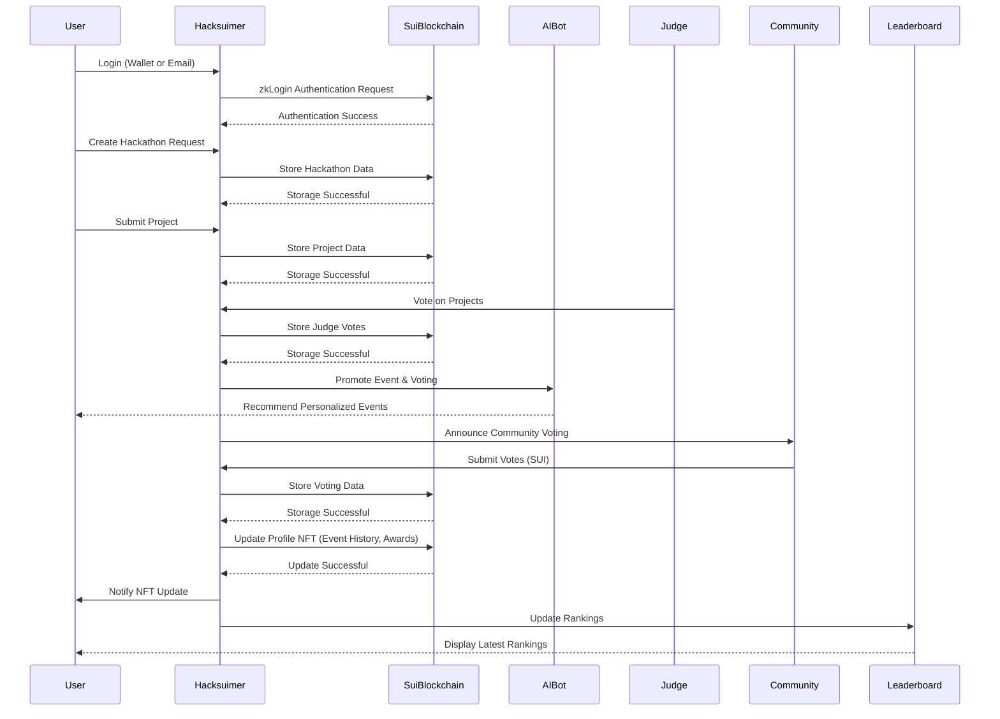

<h1 align="center">Hacksuimer</h1>

  <a href="" style="color: #a77dff">Hacksuimer</a> | <a href="" style="color: #a77dff">Demo Video</a> | <a href="" style="color: #a77dff">NFT Contract</a> | <a href="" style="color: #a77dff">Voting Contract</a>

Web3-exclusive platform for managing events and hackathons, built on the <code>Sui blockchain</code>.

## Project Description

Hacksuimer is a Web3-exclusive platform for managing events and hackathons, built on the **Sui blockchain**. The platform integrates **dynamic NFTs** to create and manage user profiles that reflect their participation, achievements, and rankings in hackathons. It also enables secure and transparent voting by judges and community members using **SUI tokens**. Additionally, Hacksuimer incorporates **AI bots** to promote events, hackathons, and submitted projects, ensuring active user engagement and visibility.

## Problem Statement

Traditional event and hackathon platforms face several challenges:

1. **Lack of Transparency:** Voting processes for hackathons often lack transparency, leading to questions about fairness and trustworthiness.
2. **Fragmented Recognition:** Participants’ achievements are scattered across platforms, making it difficult to showcase their accomplishments.
3. **Engagement Issues:** Event promotion often fails to reach the right audience, leading to low participation rates.
4. **Privacy Concerns:** Sensitive information of participants and judges is not always adequately protected.

## Solution

Hacksuimer addresses these challenges by offering:

1. **Transparent Voting:** Blockchain-based voting ensures fairness and traceability for both judge and community votes.
2. **Dynamic NFTs:** Profile NFTs store and update metadata like event participation, awards, and rankings, providing a unified and verifiable record of users’ achievements.
3. **AI-Powered Promotions:** AI agents promote events, hackathons, and projects, increasing visibility and user engagement.
4. **Enhanced Privacy:** zkLogin ensures secure and private authentication for both judges and participants.

## Key Features

### 1. User Login & Profile Management

- Wallet or email-based login options.
- Dynamic NFTs that act as user profiles, showcasing event history, awards, and rankings.
- NFTs include links to projects submitted by the user.

### 2. Hackathon & Event Creation

- Organizers can create and manage hackathons or events with customizable settings.
- Inspired by the interface of [JokeRace](https://www.jokerace.io/contest/new).
- Admin dashboard allows seamless event configuration.

### 3. Transparent Voting System

- **Judge Voting:**
    - Judges vote on projects with transparency, secured by zkLogin for privacy.
    - Comments and feedback system to provide constructive insights.
- **Community Voting:**
    - General users participate in voting rounds using SUI.

### 4. AI-Powered Event Promotion

- AI bots actively promote upcoming events, hackathons, and projects.
- Provides personalized recommendations for users based on their participation history.

### 5. Leaderboard and Achievements

- Displays top participants based on awards, event history, and votes.
- Dynamic NFTs are updated with users' latest achievements and rankings.

### 6. Privacy and Security

- zkLogin ensures that user and judge information is secure and private.

> Hacksuimer combines the best of Web3 technologies to create a transparent, engaging, and secure platform for hackathon and event management.

## User Flow Diagram

- **🖥️ Explanation**
    - **User Login:** Users log in via **wallet connection or email**, with **zkLogin** ensuring enhanced security.
    - **Hackathon Creation:** Administrators create new hackathons, and all relevant data is **stored on the Sui blockchain**.
    - **Project Submission:** Participants submit their projects, and the metadata is recorded on the blockchain.
    - **Judge Voting:** Judges **vote transparently on the blockchain** and can leave feedback for participants.
    - **AI Promotion:** The AI agent recommends personalized events to users and promotes hackathons & voting rounds.
    - **Community Voting:** General users participate in community voting using **SUI**.
    - **NFT Update:** Each participant’s **profile NFT is dynamically updated** with **event history, awards, and project links**.
    - **Leaderboard Update:** Rankings are updated based on voting results, ensuring users receive **real-time updates**.

## Flowchart

---

# hacksuimer_contract
HackSuimer Sui Contract 

### Build
`sui move build`

### Test
`sui move test`

### Deploy to testnet 
`sui move client publish --gas-budget 20000000000`
